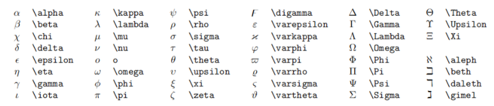

# 一级标题

## 二级标题

### 三级标题

一级标题
=======

二级标题
-------

---

每写完一个段落要隔一行空行.

就像这样, 隔了一行空行.

---

分割线

**重点加粗**

*斜体*

~~删除线~~

==高亮==

快捷键:

选中文本之后, 按下 Ctrl + B 可以给选中文本加粗.

同理 Ctrl + I 可以让选中文本变为斜体.

---

列表:

* 无序列表
  * 嵌套无序列表
  * 嵌套无序列表
* 无序列表
* 无序列表

1. 有序列表 1
   1. 嵌套有序列表 1
   2. 嵌套有序列表 2
2. 有序列表 2
3. 有序列表 3

任务列表:

- [x] 已经完成的事 1
- [x] 已经完成的事 2
- [x] 已经完成的事 3
- [x] 仍未完成的事 4
- [ ] 仍未完成的事 5

---

引用文本:

> 引用别人说的话
> 就这样写
> By. OrangeX4

---

这是 `行内代码` 语法.

代码块语法:

```python
print("Hello, World!")
```
```python {.line-numbers}
print("Hello, World!")
```


---

[超链接名称](链接地址)


---

表格:

| 表头 | 表头 |
| ---- | ---- |
| 内容 | 内容 |
| 内容 | 内容 |


拓展语法:

| aa  | bb  | cc  |
| --- | --- | --- |
| 1   |     | 2   |
| 3   | >   | 4   |
| 5   | 6   |     |
| ^   | 7   | 8   |

---

注释:

<!-- 你看不见我 -->

---

$$
\begin{cases}
x=\rho\cos\theta \\
y=\rho\sin\theta \\
\end{cases}
$$

较小的行内行分数 $\frac{1}{2}$

展示型的分式 $\displaystyle\frac{x+1}{x-1}$


数学公式中的空格和换行都会在编译时被忽略.
输入空格:

紧贴 $a\!b$

没有空格 $ab$

小空格 $a\,b$

中等空格 $a\;b$

大空格 $a\ b$

quad 空格 $a\quad b$

两个 quad 空格 $a\qquad b$

累加 $\sum_{k=1}^n\frac{1}{k}  \quad  \displaystyle\sum_{k=1}^n\frac{1}{k}$

累乘 $\prod_{k=1}^n\frac{1}{k}  \quad  \displaystyle\prod_{k=1}^n\frac{1}{k}$

积分 $\displaystyle \int_0^1x{\rm d}x  \quad  \iint_{D_{xy}}  \quad  \iiint_{\Omega_{xyz}}$

圆括号 $\displaystyle \left(\sum_{k=1}^{n}\frac{1}{k} \right)^2$

方括号 $\displaystyle \left[\sum_{k=1}^{n}\frac{1}{k} \right]^2$

花括号 $\displaystyle \left\{\sum_{k=1}^{n}\frac{1}{k} \right\}^2$

尖括号 $\displaystyle \left\langle\sum_{k=1}^{n}\frac{1}{k} \right\rangle^2$

<br/>
#
#

上标
30^th^
下标
H~2~O

#

&emsp;多行算式对齐
居中:

$$
\begin{aligned}
y &=(x+5)^2-(x+1)^2 \\
&=(x^2+10x+25)-(x^2+2x+1) \\
&=8x+24 \\
\end{aligned}
$$

左对齐:

$
\begin{aligned}
y &=(x+5)^2-(x+1)^2 \\
&=(x^2+10x+25)-(x^2+2x+1) \\
&=8x+24 \\
\end{aligned}
$

#
方程组
$$
\begin{cases}
k_{11}x_1+k_{12}x_2+\cdots+k_{1n}x_n=b_1 \\
k_{21}x_1+k_{22}x_2+\cdots+k_{2n}x_n=b_2 \\
\cdots \\
k_{n1}x_1+k_{n2}x_2+\cdots+k_{nn}x_n=b_n \\
\end{cases}
$$

#
矩阵:

$$
  \begin{pmatrix}
  1 & 1 & \cdots & 1 \\
  1 & 1 & \cdots & 1 \\
  \vdots & \vdots & \ddots & \vdots \\
  1 & 1 & \cdots & 1 \\
  \end{pmatrix}
$$

$$
\begin{bmatrix}
1 & 1 & \cdots & 1 \\
1 & 1 & \cdots & 1 \\
\vdots & \vdots & \ddots & \vdots \\
1 & 1 & \cdots & 1 \\
\end{bmatrix}
$$ 

$$
  \begin{pmatrix}
  1 & 1 & \cdots & 1 \\
  1 & 1 & \cdots & 1 \\
  \vdots & \vdots & \ddots & \vdots \\
  1 & 1 & \cdots & 1 \\
  \end{pmatrix}
  \quad
  \begin{bmatrix}
  1 & 1 & \cdots & 1 \\
  1 & 1 & \cdots & 1 \\
  \vdots & \vdots & \ddots & \vdots \\
  1 & 1 & \cdots & 1 \\
  \end{bmatrix}
$$ 

行列式: 
$$
\begin{vmatrix}
1 & 1 & \cdots & 1 \\
1 & 1 & \cdots & 1 \\
\vdots & \vdots & \ddots & \vdots \\
1 & 1 & \cdots & 1 \\
\end{vmatrix}
$$




---

脚注
Content [^1]

[^1]: Hi! This is a footnote
